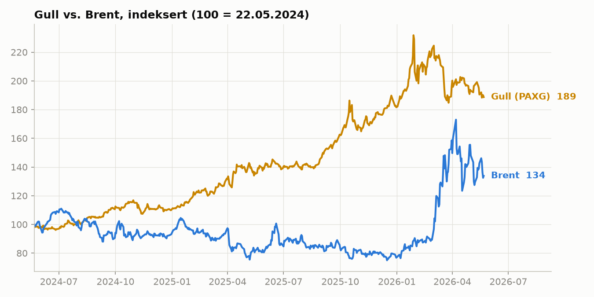
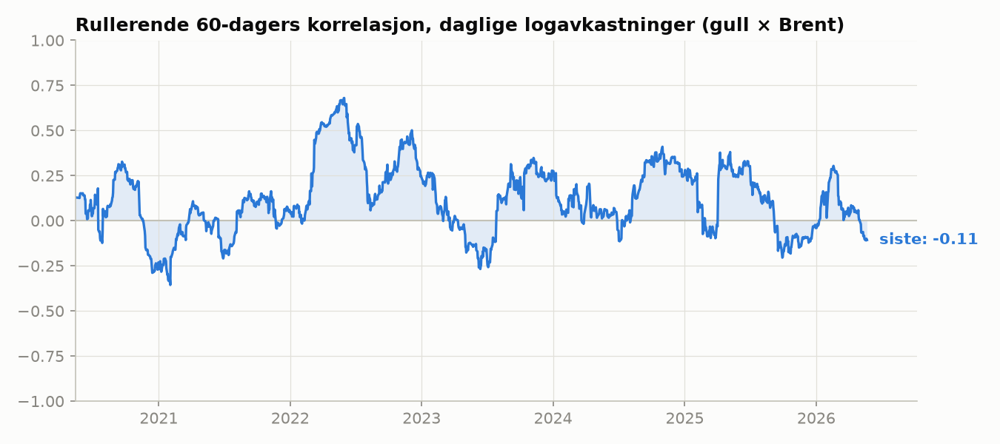
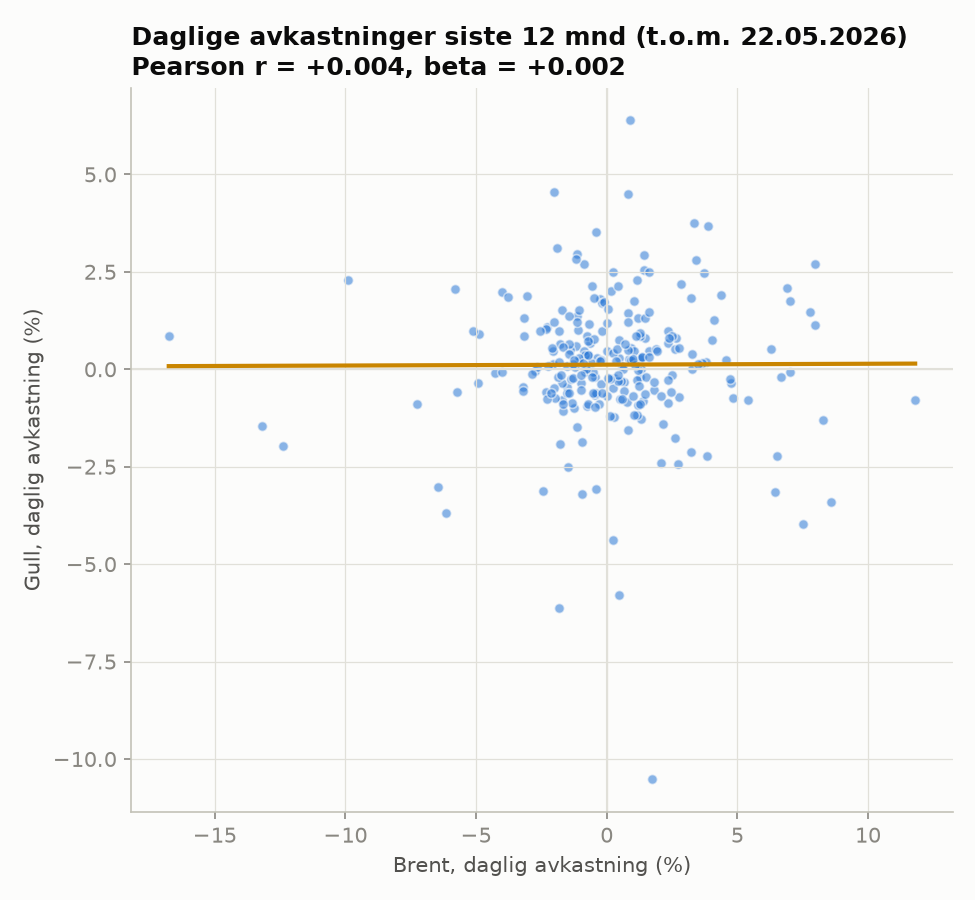
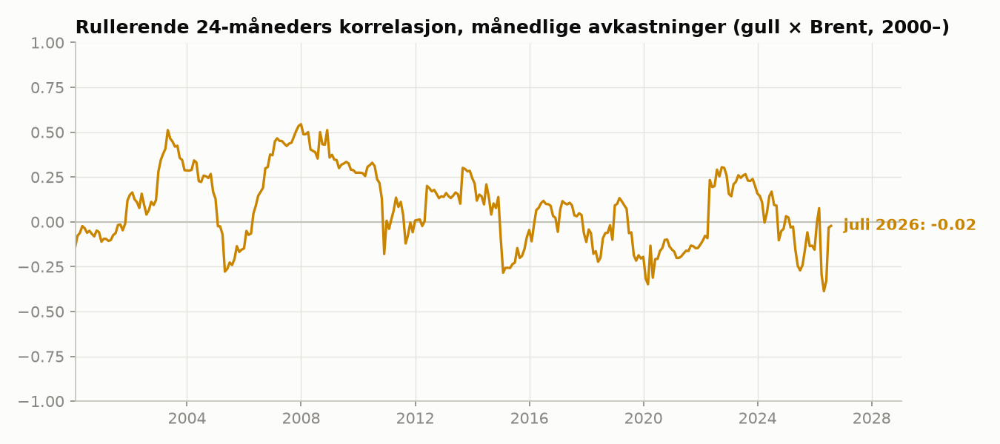

# Korrelasjon mellom gullpris og oljepris — analyse per 7. august 2026

## Hovedfunn (TL;DR)

**Gull og olje har vært svakt *negativt* korrelert den siste tiden.** På ukentlige
avkastninger er korrelasjonen (gull × Brent) **−0,41 siste 6 måneder** og **−0,31
siste 12 måneder** (begge statistisk signifikante, p < 0,05). På daglige og
månedlige avkastninger er korrelasjonen rundt null. Den historisk vanlige svakt
positive samvariasjonen (typisk +0,1 til +0,5 siden 2000) har altså brutt sammen:
gull har steget kraftig (~+90 % på to år, drevet av sikker havn-etterspørsel og
sentralbankkjøp), mens olje har beveget seg på egne, tilbudsdrevne nyheter.

| Mål | Vindu | Korrelasjon |
|---|---|---|
| Ukentlige avkastninger (gull × Brent) | 6 mnd | **−0,41** (p = 0,04) |
| Ukentlige avkastninger (gull × Brent) | 12 mnd | **−0,31** (p = 0,03) |
| Daglige avkastninger (gull × Brent) | 12 mnd | +0,00 (ikke sign.) |
| Daglige avkastninger (gull × WTI) | 3 mnd | −0,17 (ikke sign.) |
| Månedlige avkastninger (gull × Brent) | 3 år | −0,04 (ikke sign.) |
| Rullerende 60-dagers (daglig), siste verdi | mai 2026 | −0,11 |
| Rullerende 24-mnd (månedlig), juli 2026 | — | −0,02 |

Fullstendige tall: [`output/resultater.md`](output/resultater.md).

## Grafer

## Tolkning

- **Prisnivåene** forteller en tydelig historie: siden mai 2024 er gull opp ~89 %
  mens Brent er opp ~34 % — men nesten hele oljeoppgangen kom i et rykk i
  feb–mars 2026, i en periode der gull samtidig toppet ut og falt tilbake. De
  siste 3 månedene er nivåkorrelasjonen sterkt negativ (−0,77), fordi gull har
  falt fra toppen mens olje har holdt seg oppe.
- **Avkastningskorrelasjonen** (det riktige målet for samvariasjon) har svingt
  mellom −0,2 og +0,33 det siste året på 60-dagersbasis, uten stabilt fortegn —
  og er negativ på slutten av serien. Ukedata, som er mer robuste mot at
  gullproxyen handles døgnet rundt mens olje har børsstengetider, viser klarest
  negativ korrelasjon.
- **Historisk kontekst:** i 24-månedersvinduer har korrelasjonen på månedsdata
  ligget mellom −0,4 og +0,55 siden 2000, oftest svakt positiv (felles
  drivere: USD, inflasjon, global vekst). Dagens verdi nær null/negativ er lavt,
  men ikke uten presedens (ligner 2015 og 2020).

## Data og metode

| Serie | Kilde | Frekvens | Dekning |
|---|---|---|---|
| Brent & WTI spot | [datasets/oil-prices](https://github.com/datasets/oil-prices) (EIA) | Daglig | → 2026-08-03 |
| Gull (proxy: PAXG, 1 token = 1 oz) | [coinmetrics/data](https://github.com/coinmetrics/data) | Daglig | → 2026-05-23 |
| Gullfutures GC=F (kun proxy-validering) | [FeziweMelvin/XAUUSD-Gold-Price](https://github.com/FeziweMelvin/XAUUSD-Gold-Price) | Daglig | → 2025-06-06 |
| Gull (World Bank Pink Sheet) | [datasets/gold-prices](https://github.com/datasets/gold-prices) | Månedlig | → 2026-07 |

- Direktekilder for daglig gullspot (LBMA, Yahoo, Stooq, FRED) var ikke
  tilgjengelige fra analysemiljøet (nettverkspolicy); PAXG brukes derfor som
  daglig proxy. Valideringen mot gullfutures viser at PAXG følger gullprisen
  tett på **nivå** (median absolutt avvik 0,45 %), mens korrelasjonen på
  *daglige* avkastninger (0,79) dempes av at PAXG handles 24/7 med UTC-døgnslutt
  — derfor rapporteres også ukentlige tall, som er robuste mot dette.
- Korrelasjoner er Pearson (og Spearman) på **logavkastninger** — korrelasjon på
  prisnivåer mellom to trendende serier er i stor grad spuriøs og rapporteres kun
  som referanse.
- Analysen reproduseres med `python3 gold_oil_correlation.py`
  (krever `pandas`, `numpy`, `scipy`, `matplotlib`).

## Forbehold

- Daglig analyse stopper 22. mai 2026 (siste dato med både gull- og oljedata);
  månedlig analyse dekker til og med juli 2026.
- PAXG kan i korte perioder avvike fra spotgull (kryptomarkeds-likviditet);
  95-persentilen av avviket er 1,4 %.
- Oljeprisene er EIA-spotpriser (publiseres med noen dagers etterslep).
